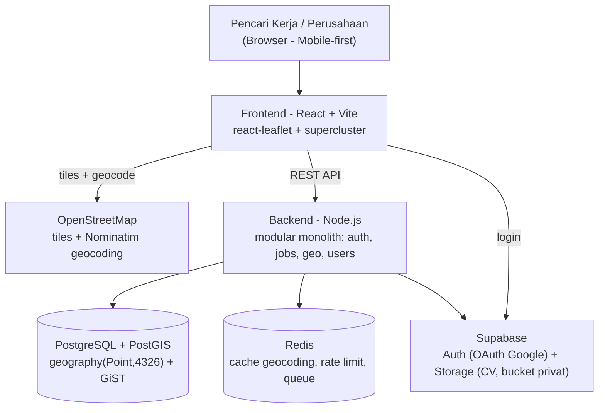

<div align="center">

# 🗺️ JOBARTA
### Cari kerja di sekitarmu — lewat peta, bukan lewat daftar tanpa ujung.

[](https://[URL_DEMO])
[](https://github.com/kikisdadw2/jobarta)
[](LICENSE)

**Submission for ITECHNO CUP 2026 - Web Development**

**By [Nama Tim]**

</div>

---

## 📋 Daftar Isi

- [Tentang Proyek](#-tentang-proyek)
- [Fitur Unggulan](#-fitur-unggulan)
- [Demo & Screenshot](#-demo--screenshot)
- [Teknologi](#-teknologi)
- [Arsitektur Sistem](#-arsitektur-sistem)
- [Instalasi & Setup](#-instalasi--setup)
- [Penggunaan](#-penggunaan)
- [API Documentation](#-api-documentation)
- [Testing](#-testing)
- [Tim Developer](#-tim-developer)
- [Lisensi](#-lisensi)

---

## 👥 Tim Developer

| Nama | Peran | GitHub |
|------|-------|--------|
| **[Nama Lengkap 1]** | Project Lead & Backend / Data (DB + PostGIS, API, auth & RBAC, query geo, keamanan) | [@username1](https://github.com/[username1]) |
| **[Nama Lengkap 2]** | Frontend & Peta (React, Leaflet, UI responsif, integrasi API) | [@username2](https://github.com/[username2]) |
| **[Nama Lengkap 3]** | Support / QA / Docs (seeding lowongan, testing, deploy, riset user) | [@username3](https://github.com/[username3]) |

> Aturan tim: saat terjadi beda pendapat, satu orang ditetapkan sebagai *pemilik keputusan*.

---

## 🎯 Tentang Proyek

### Latar Belakang

Pencarian kerja untuk posisi entry-level dan pekerjaan harian di Jakarta hampir seluruhnya berbentuk **daftar teks**. Padahal untuk segmen ini, faktor penentu utamanya sederhana: **jarak**. Ongkos dan waktu perjalanan sering memakan porsi besar dari upah, sehingga lowongan bagus yang berada 20 km dari rumah praktis tidak relevan. Portal kerja yang ada menampilkan lokasi sebagai teks alamat atau filter "kota/kecamatan" yang kasar — pencari kerja tidak pernah benar-benar tahu *seberapa dekat* lowongan itu dari tempat tinggalnya.

Di sisi lain, UMKM, ritel, F&B, dan gudang di Jakarta merekrut secara hiperlokal — banyak yang masih mengandalkan tulisan "DIBUTUHKAN KARYAWAN" yang ditempel di kaca toko, karena portal kerja nasional terasa tidak sepadan untuk mengisi satu posisi di satu lokasi.

### Solusi yang Ditawarkan

JOBARTA membalik urutannya: **peta lebih dulu, daftar kemudian.** Perusahaan yang sudah terverifikasi memasang lowongan lengkap dengan pin lokasi presisi; pencari kerja membuka peta, menetapkan titik dan radius pencarian, lalu melihat lowongan yang benar-benar berada dalam jangkauan hariannya, dan melamar langsung dari sana.

Pencarian berbasis jarak dijalankan di level database dengan **PostgreSQL + PostGIS** (`geography(Point,4326)` + index GiST) dan dibatasi ke *bounding box* viewport, sehingga tetap ringan di HP kelas menengah.

### Tujuan Proyek

- 🎯 **Tujuan Utama**: Menjalankan alur nilai inti secara penuh — perusahaan terverifikasi posting lowongan dengan pin lokasi → pencari kerja menemukannya lewat peta + radius search → melamar → perusahaan mengelola status lamaran.
- 📊 **Target Pengguna**: Pencari kerja entry-level/harian di Jakarta yang sensitif terhadap jarak & ongkos, serta pemilik UMKM, ritel, F&B, dan gudang yang merekrut secara hiperlokal.
- 💡 **Value Proposition**: Satu-satunya cara mencari kerja di mana **jarak jadi filter utama, bukan catatan kaki** — ditambah verifikasi legalitas perusahaan wajib sebelum boleh memasang lowongan, sebagai tameng terhadap lowongan palsu.

> **Batas ruang lingkup v1 (eksplisit BUKAN v1):** chat real-time, matching otomatis, dan notifikasi email. Fitur-fitur ini baru dibangun setelah terbukti ada lamaran yang benar-benar direspons.

---

## ✨ Fitur Unggulan

### Fitur Utama

| Fitur | Deskripsi | Keunggulan |
|-------|-----------|------------|
| **Peta Lowongan Interaktif** | Split view daftar + peta yang tersinkron: hover pin menyorot job card, dan sebaliknya. Tombol "lokasi saya" untuk memusatkan peta. | Pencari kerja langsung melihat konteks geografis lowongan, bukan menebak dari teks alamat. |
| **Radius Search Berbasis PostGIS** | Filter lowongan berdasarkan titik + radius, dieksekusi sebagai query spasial di database dan dibatasi ke bounding box viewport. | Akurat sampai level meter dan tetap cepat karena data yang dikirim hanya sebatas layar yang terlihat. |
| **Verifikasi Legalitas Perusahaan** | Status `pending / verified / rejected`; perusahaan yang belum terverifikasi **tidak bisa** memasang lowongan. Ada panel admin untuk approve/reject. | Menutup celah utama lowongan penipuan yang jadi masalah kronis portal kerja. |
| **Sistem Lamaran Terlacak** | Apply sekali klik dengan pencegahan lamaran ganda, status tracking, halaman "Lamaran Saya" bagi seeker, dan daftar pelamar bagi perusahaan. | Kedua sisi tahu posisi lamaran tanpa perlu saling mengejar lewat kanal luar. |

### Fitur Tambahan

- **Marker Clustering** - Pin digabung otomatis saat zoom-out agar peta tetap terbaca di area padat.
- **Map Picker + Geocoding Otomatis** - Perusahaan mengetik alamat, sistem menaruh pin lewat Nominatim, dan pin bisa dikoreksi manual untuk alamat gang/jalan kecil.
- **Profil & CV Terstruktur** - Unggah CV tervalidasi, disimpan di object storage privat dan diakses lewat *signed URL* berumur pendek.
- **Mobile-First** - Peta full-screen + bottom sheet di layar kecil; dikerjakan bersamaan dengan versi desktop, bukan sebagai polish belakangan.
- **Login Google (OAuth)** - Pendaftaran tanpa password, dilanjutkan onboarding pemilihan peran dan persetujuan PDP.
- **Desain Aksesibel** - Design system *Accessible & Ethical*, kontras WCAG AA+, ritme spasi 8pt, `100dvh` untuk viewport mobile.

---

## 📸 Demo & Screenshot

### Live Demo

🔗 **[Kunjungi Website](https://[URL_DEMO])**

### Screenshot Aplikasi

<div align="center">
  
  <p><em>Homepage - Landing dan entry point pencarian</em></p>

  
  <p><em>Halaman Peta - Split view daftar lowongan + peta dengan radius search</em></p>

  
  <p><em>Posting Lowongan - Form dengan map picker dan geocoding otomatis</em></p>
</div>

### Video Demo

📹 **[Link Video Demo](https://[URL_VIDEO])** _(opsional)_

---

## 🛠️ Teknologi

### Tech Stack

#### Frontend
```
Framework    : React.js (Vite)
UI Library   : CSS (design system kustom, ritme 8pt, WCAG AA+)
Peta         : react-leaflet + supercluster (clustering)
Font         : Lexend (heading) / Source Sans 3 (body)
```

#### Backend
```
Runtime      : Node.js
Arsitektur   : Modular monolith (auth, jobs, geo, users, chat)
Database     : PostgreSQL + PostGIS - geography(Point,4326) + index GiST
Auth         : OAuth Google via Supabase Auth (RBAC lewat RLS Postgres)
Storage      : Supabase Storage - bucket privat + signed URL
Cache/Queue  : Redis
Real-time    : Socket.io (Fase 4)
```

#### DevOps & Tools
```
Deployment   : Vercel (staging + production)
CI/CD        : GitHub Actions
Monitoring   : Sentry
Backup       : Backup database harian otomatis (diuji restore)
Peta/Geocode : OpenStreetMap tiles + Nominatim
```

### Alasan Pemilihan Teknologi

| Teknologi | Alasan Pemilihan |
|-----------|------------------|
| **PostgreSQL + PostGIS** | Inti produk adalah pencarian berbasis jarak. PostGIS memberi tipe `geography` dan index GiST sehingga query radius berjalan di database dengan akurasi geodesik — jauh lebih cepat dan benar dibanding menghitung jarak di sisi aplikasi. |
| **OpenStreetMap + Nominatim** | Bebas biaya lisensi dan bebas vendor lock-in, penting untuk proyek yang harus bisa berjalan tanpa anggaran API peta. Konsekuensinya (rate limit ±1 req/detik) ditangani lewat debounce, cache Redis, dan opsi koreksi pin manual. |
| **React + react-leaflet** | Peta interaktif dengan ratusan pin butuh rendering deklaratif dan kontrol state yang ketat; react-leaflet memberi jembatan langsung ke Leaflet tanpa membungkusnya berlebihan, dan supercluster menjaga performa saat zoom-out. |
| **Modular monolith (Node.js)** | Tim kecil (3 orang). Batas modul yang jelas memberi kerapian microservice tanpa ongkos operasional deployment terpisah. |
| **Supabase (Auth + Storage)** | OAuth Google, Row Level Security, dan bucket privat dengan signed URL tersedia langsung — melindungi data CV (kewajiban UU PDP No. 27/2022) tanpa membangun layanan auth dan storage sendiri. |

### Dependencies Utama

```json
{
  "dependencies": {
    "react": "^18.x",
    "react-leaflet": "^4.x",
    "leaflet": "^1.9.x",
    "supercluster": "^8.x",
    "express": "^4.x",
    "pg": "^8.x",
    "@supabase/supabase-js": "^2.x",
    "ioredis": "^5.x",
    "zod": "^3.x"
  }
}
```

---

## 🏗️ Arsitektur Sistem

### System Architecture



### Database Schema

> ⚠️ ERD saat ini sedang diregenerasi — versi lama masih menggambarkan auth email + password, sedangkan stack sudah pindah ke OAuth Google.

```
[ERD final menyusul — entitas inti: users, seeker_profiles, companies,
 company_members, jobs, applications, regions, conversations, messages]
```

### Folder Structure

```
project-root/
├── apps/
│   ├── web/                # Frontend React + Vite
│   │   ├── src/
│   │   │   ├── components/ # Komponen reusable (MapView, JobCard, dll)
│   │   │   ├── pages/      # Halaman
│   │   │   ├── hooks/      # Custom hooks
│   │   │   ├── services/   # Klien API
│   │   │   └── styles/     # Design system & token
│   │   └── public/
│   └── api/                # Backend Node.js (modular monolith)
│       └── src/modules/
│           ├── auth/       # OAuth, sesi, RBAC
│           ├── jobs/       # Lowongan & lamaran
│           ├── geo/        # Query PostGIS, geocoding, cache
│           ├── users/      # Profil seeker & perusahaan
│           └── chat/       # Socket.io (Fase 4)
├── db/
│   ├── migrations/         # Migrasi skema + PostGIS
│   └── seeds/              # Data wilayah DKI & lowongan pilot
├── tests/
└── docs/
```

---

## ⚙️ Instalasi & Setup

### Prerequisites

Pastikan Anda telah menginstall:
- **Node.js** (v18.x atau lebih tinggi)
- **npm** / **yarn** / **pnpm**
- **PostgreSQL** (v15 atau lebih tinggi) dengan ekstensi **PostGIS**
- **Redis**
- **Git**

### Langkah Instalasi

#### 1️⃣ Clone Repository

```bash
git clone https://github.com/kikisdadw2/jobarta.git
cd jobarta
```

#### 2️⃣ Install Dependencies

```bash
npm install
```

#### 3️⃣ Setup Environment Variables

Buat file `.env` di root directory:

```env
# Database
DATABASE_URL="[connection_string]"

# Supabase (Auth + Storage)
SUPABASE_URL="[supabase_project_url]"
SUPABASE_ANON_KEY="[supabase_anon_key]"
SUPABASE_SERVICE_ROLE_KEY="[supabase_service_role_key]"

# Redis
REDIS_URL="[redis_connection_string]"

# Geocoding (Nominatim mewajibkan User-Agent identitas aplikasi)
NOMINATIM_BASE_URL="https://nominatim.openstreetmap.org"
NOMINATIM_USER_AGENT="JOBARTA/1.0 ([email_kontak])"

# Other configs
NODE_ENV="development"
PORT=3000
```

> Semua nilai di atas adalah placeholder. Simpan kredensial asli sebagai environment variable, jangan di-commit ke repository.

#### 4️⃣ Setup Database

```bash
# Aktifkan ekstensi PostGIS lalu jalankan migrasi
npm run db:migrate

# Seed data wilayah DKI + lowongan area pilot
npm run db:seed
```

#### 5️⃣ Run Development Server

```bash
npm run dev
```

Aplikasi akan berjalan di `http://localhost:3000`

---

## 🚀 Penggunaan

### Menjalankan Aplikasi

```bash
# Development mode
npm run dev

# Production build
npm run build
npm run start

# Run tests
npm run test

# Linting
npm run lint
```

### User Guide

#### Untuk Pencari Kerja

1. **Login**: Masuk dengan akun Google, lalu pilih peran "Pencari Kerja" dan setujui kebijakan privasi di halaman onboarding.
2. **Atur Lokasi & Radius**: Tetapkan titik acuan (atau tekan "lokasi saya") dan atur radius pencarian sesuai jangkauan harian Anda.
3. **Jelajahi Peta**: Telusuri pin lowongan; hover pin untuk menyorot detailnya di daftar, atau gunakan filter kategori.
4. **Melamar**: Buka lowongan, tekan "Lamar", unggah CV saat diminta pertama kali. Pantau statusnya di halaman "Lamaran Saya".

#### Untuk Perusahaan

1. **Login & Buat Profil Perusahaan**: Masuk dengan Google, pilih peran "Perusahaan", lengkapi profil, dan ajukan dokumen legalitas untuk verifikasi.
2. **Menunggu Verifikasi**: Posting lowongan baru terbuka setelah status berubah menjadi `verified`.
3. **Posting Lowongan**: Isi form, ketik alamat untuk geocoding otomatis, lalu **koreksi pin secara manual** bila lokasi berada di gang atau jalan kecil.
4. **Kelola Pelamar**: Tinjau daftar pelamar dan perbarui status lamaran.

#### Untuk Admin

1. **Akses Admin Panel**: Login dengan akun berperan admin.
2. **Verifikasi Perusahaan**: Tinjau dokumen legalitas, lalu approve atau reject pengajuan.
3. **Moderasi**: Tindaklanjuti laporan lowongan mencurigakan.

---

## 📚 API Documentation

### Base URL

```
Development: http://localhost:3000/api
Production:  https://[domain]/api
```

### Endpoints

#### Authentication

```http
GET  /api/auth/google        # Mulai OAuth Google
GET  /api/auth/callback      # Callback OAuth
POST /api/auth/onboarding    # Pilih peran + consent PDP
POST /api/auth/logout
GET  /api/auth/me
```

#### Jobs

```http
GET    /api/jobs                # Daftar lowongan (mendukung filter)
GET    /api/jobs/nearby         # Radius search - params: lat, lng, radius, bbox
GET    /api/jobs/:id
POST   /api/jobs                # Buat lowongan (perusahaan verified saja)
PUT    /api/jobs/:id
DELETE /api/jobs/:id
```

#### Applications

```http
GET    /api/applications/me     # Lamaran milik seeker
GET    /api/jobs/:id/applicants # Daftar pelamar (pemilik lowongan)
POST   /api/jobs/:id/apply      # Melamar (dicegah bila sudah pernah)
PATCH  /api/applications/:id    # Perbarui status lamaran
```

#### Geo

```http
GET /api/geo/geocode?q=[alamat] # Geocoding via Nominatim (debounce + cache Redis)
GET /api/geo/regions            # Wilayah DKI (kecamatan/kelurahan)
```

### Example Request

```javascript
// Radius search - cari lowongan dalam 5 km dari titik pengguna
const params = new URLSearchParams({
  lat: '-6.2846',
  lng: '106.8451',
  radius: '5000', // meter
  bbox: '106.80,-6.32,106.89,-6.25'
});

const response = await fetch(`/api/jobs/nearby?${params}`, {
  headers: { 'Content-Type': 'application/json' }
});
const jobs = await response.json();
```

📖 **[Dokumentasi API Lengkap](./docs/API.md)** _(opsional)_

---

## 🧪 Testing

### Running Tests

```bash
# Unit tests
npm run test

# Integration tests
npm run test:integration

# E2E tests
npm run test:e2e

# Test coverage
npm run test:coverage
```

### Pengujian Tambahan

- **Black box testing** terhadap alur inti (posting → temukan → lamar → kelola status).
- **Kuesioner kepuasan pengguna** (Likert/SUS) dari peserta closed beta.
- **Uji performa perangkat rendah**: dijalankan di HP Android kelas menengah-bawah dengan koneksi lambat.
- **Uji akurasi geocoding**: 40–50 alamat asli di area pilot; bila deviasi >200 m terjadi pada >20% sampel, koreksi pin manual diwajibkan.

### Test Coverage

```
Statements   : XX%
Branches     : XX%
Functions    : XX%
Lines        : XX%
```

---

## 📄 Lisensi

Proyek ini dilisensikan di bawah [MIT License](LICENSE) - lihat file LICENSE untuk detail lebih lanjut.

Data peta © [OpenStreetMap contributors](https://www.openstreetmap.org/copyright), tersedia di bawah lisensi ODbL.

---

<div align="center">

  **Made with ❤️ by [Nama Tim] for ITECHNO CUP 2026**

</div>
