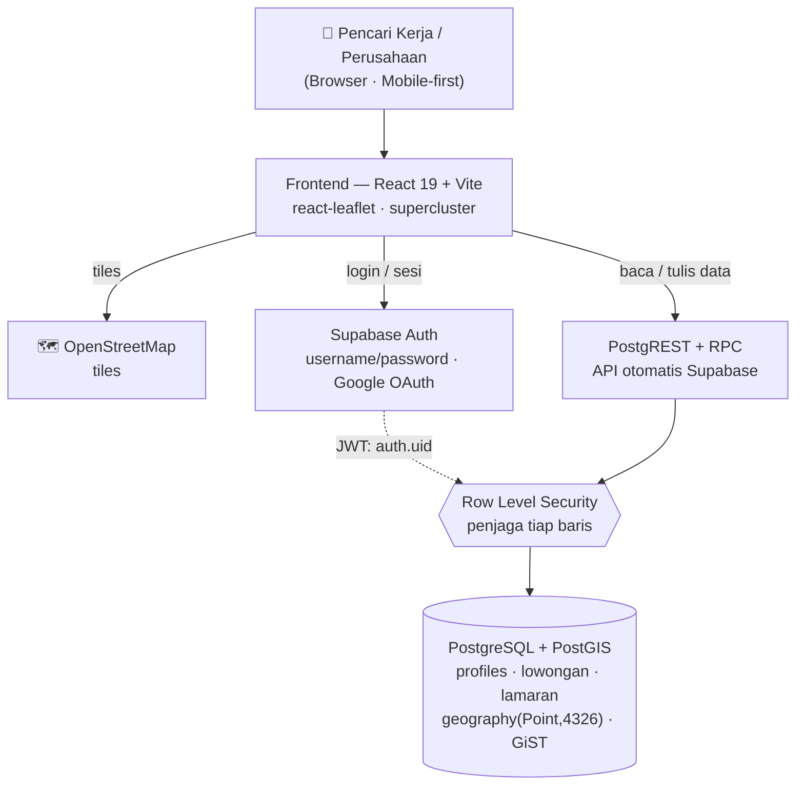

<div align="center">

# 🗺️ JOBARTA
### Cari kerja di sekitarmu — lewat peta, bukan lewat daftar tanpa ujung.

[](https://jobarta.vercel.app)
[](https://github.com/kikisdadw2/jobarta)
[](LICENSE)

**Submission for ITECHNO CUP 2026 - Web Development**

**By Curisous Cats**

</div>

---

## 📋 Daftar Isi

- [Tim Developer](#-tim-developer)
- [Tentang Proyek](#-tentang-proyek)
- [Fitur Unggulan](#-fitur-unggulan)
- [Batasan yang Disadari](#️-batasan-yang-disadari)
- [Demo & Screenshot](#-demo--screenshot)
- [Teknologi](#️-teknologi)
- [Arsitektur Sistem](#️-arsitektur-sistem)
- [Model Data & Keamanan](#-model-data--keamanan)
- [Instalasi & Setup](#️-instalasi--setup)
- [Penggunaan](#-penggunaan)
- [Testing](#-testing)
- [Lisensi](#-lisensi)

---

## 👥 Tim Developer

| Nama | Peran | GitHub |
|------|-------|--------|
| **Nicky Oliver Constantine** | Project Lead & Backend / Data (skema PostGIS, RLS, auth, query geo, keamanan) | [@username1](https://github.com/username1) |
| **Rizky Ghazirah Himawan** | Frontend & Peta (React, Leaflet, UI responsif, integrasi data) | [@username2](https://github.com/username2) |
| **Imam I'tisham** | Support / QA / Docs (seeding lowongan, testing, deploy, riset user) | [@IkamWorkshop](https://github.com/IkamWorkshop) |

> Aturan tim: saat terjadi beda pendapat, satu orang ditetapkan sebagai *pemilik keputusan*.

---

## 🎯 Tentang Proyek

### Latar Belakang

Pencarian kerja untuk posisi entry-level dan pekerjaan harian di Jakarta hampir seluruhnya berbentuk **daftar teks**. Padahal untuk segmen ini, faktor penentu utamanya sederhana: **jarak**. Ongkos dan waktu perjalanan sering memakan porsi besar dari upah, sehingga lowongan bagus yang berada 20 km dari rumah praktis tidak relevan. Portal kerja yang ada menampilkan lokasi sebagai teks alamat atau filter "kota/kecamatan" yang kasar — pencari kerja tidak pernah benar-benar tahu *seberapa dekat* lowongan itu dari tempat tinggalnya.

Di sisi lain, UMKM, ritel, F&B, dan gudang di Jakarta merekrut secara hiperlokal — banyak yang masih mengandalkan tulisan "DIBUTUHKAN KARYAWAN" yang ditempel di kaca toko, karena portal kerja nasional terasa tidak sepadan untuk mengisi satu posisi di satu lokasi.

### Solusi yang Ditawarkan

JOBARTA membalik urutannya: **peta lebih dulu, daftar kemudian.** Perusahaan memasang lowongan lengkap dengan pin lokasi presisi; pencari kerja membuka peta, menetapkan titik dan radius pencarian, lalu melihat lowongan yang benar-benar berada dalam jangkauan hariannya, dan melamar langsung dari sana.

Pencarian berbasis jarak dijalankan **di level database** dengan PostgreSQL + PostGIS — kolom `geography(Point,4326)` yang diturunkan otomatis dari lat/lng, index GiST, dan fungsi `lowongan_dekat()` yang memakai `ST_DWithin`. Perhitungan jarak tidak pernah dibebankan ke HP pengguna.

### Tujuan Proyek

- 🎯 **Tujuan Utama**: Menjalankan alur nilai inti secara penuh — perusahaan memasang lowongan dengan pin lokasi → pencari kerja menemukannya lewat peta + radius → melamar → perusahaan melihat pelamarnya dan mengelola status lamaran.
- 📊 **Target Pengguna**: Pencari kerja entry-level/harian di Jakarta yang sensitif terhadap jarak & ongkos, serta pemilik UMKM, ritel, F&B, dan gudang yang merekrut secara hiperlokal.
- 💡 **Value Proposition**: Satu-satunya cara mencari kerja di mana **jarak jadi filter utama, bukan catatan kaki**, ditambah penanda verifikasi legalitas perusahaan sebagai pembeda kepercayaan.

> **Batas ruang lingkup v1 (eksplisit BUKAN v1):** chat real-time, matching otomatis, dan notifikasi email. Fitur-fitur ini baru dibangun setelah terbukti ada lamaran yang benar-benar direspons.

---

## ✨ Fitur Unggulan

Semua yang tercantum di bawah **sudah berjalan** dan tersimpan di database, bukan rencana. Yang belum selesai dikumpulkan terpisah di [Batasan yang Disadari](#️-batasan-yang-disadari).

### Fitur Utama

| Fitur | Deskripsi | Keunggulan |
|-------|-----------|------------|
| **Peta Lowongan Interaktif** | Daftar dan peta yang tersinkron: memilih pin membuka panel detail, dan saringan kategori/tipe/gaji bekerja pada keduanya. Tombol "Lokasi Saya" memusatkan peta. | Pencari kerja langsung melihat konteks geografis lowongan, bukan menebak dari teks alamat. |
| **Radius Search Berbasis PostGIS** | Fungsi `lowongan_dekat(lat, lng, radius)` menjalankan `ST_DWithin` pada kolom `geography` beracuan index GiST, mengembalikan lowongan aktif beserta jaraknya dalam meter, terurut dari yang terdekat. | Akurasi geodesik sampai level meter, dan query tidak memindai seluruh tabel. |
| **Sistem Lamaran Terlacak Dua Arah** | Pencari kerja melamar sekali klik; employer melihat **nama pelamar** di dasbornya dan mengubah status (Terkirim → Dilihat → Diproses → Diterima/Belum cocok); perubahan itu langsung terbaca pelamar di halaman "Lamaran Saya". | Kedua sisi tahu posisi lamaran tanpa saling mengejar lewat kanal luar. |
| **Keamanan Baris demi Baris (RLS)** | Setiap tabel dijaga Row Level Security PostgreSQL: pelamar hanya melihat lamarannya sendiri, employer hanya melihat lamaran ke lowongan miliknya, dan status hanya bisa diubah pemilik lowongan. | Aturan akses ditegakkan database, sehingga tetap berlaku walau seseorang memanggil API langsung tanpa lewat antarmuka. |

### Fitur Tambahan

- **Marker Clustering** — pin digabung otomatis saat zoom-out (supercluster) agar peta tetap terbaca di area padat.
- **Dua Jalur Masuk** — username + password, serta Google OAuth. Tombol Google **muncul sendiri** begitu providernya dinyalakan di backend, karena aplikasi menanyakan penyedia aktif saat dimuat.
- **Peta Tidak Pernah Kosong** — 30 lowongan contoh disertakan dari sisi klien dan digabung dengan lowongan sungguhan dari database, sehingga peta tetap terisi bahkan bila backend bermasalah.
- **Penanda Verifikasi Perusahaan** — lowongan dari perusahaan terverifikasi diberi penanda; lowongan yang belum terverifikasi **tetap tayang** dengan pin bergaris putus dan peringatan. Verifikasi di JOBARTA adalah pembeda kepercayaan, bukan gerbang tayang — kalau ia jadi gerbang, employer baru melihat kerjanya menghilang dan tidak pernah kembali.
- **Mobile-First** — peta full-screen + bottom sheet di layar kecil, dikerjakan bersamaan dengan versi desktop.
- **Desain Aksesibel** — design system kustom, kontras WCAG AA+, ritme spasi 8pt, `100dvh` untuk viewport mobile.

---

## ⚠️ Batasan yang Disadari

Bagian ini sengaja ditulis. Untuk tenggat yang pendek, kami memilih menyelesaikan alur inti sampai benar-benar berjalan daripada menyebar usaha ke banyak fitur setengah jadi.

| Batasan | Keadaan sekarang | Kenapa ditunda |
|---|---|---|
| **Berkas CV** | Hanya metadata (nama berkas, ukuran) yang disimpan; berkasnya sendiri tidak diunggah | Butuh object storage + signed URL. Alur lamaran sudah bisa dibuktikan tanpa itu |
| **Profil & verifikasi perusahaan** | Masih tersimpan di perangkat masing-masing; tombol verifikasi bersifat simulasi | Menaikkan penanda terverifikasi untuk semua orang butuh peran admin, di luar cakupan v1 |
| **Google OAuth** | Provider belum dikonfigurasi; tombolnya otomatis disembunyikan | Jalur username + password sudah menutup kebutuhan masuk |
| **Geocoding alamat** | Lokasi ditentukan dengan menaruh pin di peta, bukan dari mengetik alamat | Nominatim membatasi ±1 permintaan/detik dan melarang pemakaian produksi tanpa penyesuaian |
| **Sebagian tes E2E** | 12 dari 41 tes merah | Tes-tes itu menanam sesi palsu di `localStorage`, cara yang berhenti berlaku setelah autentikasi jadi sungguhan. Semuanya hijau saat dijalankan tanpa backend |

---

## 📸 Demo & Screenshot

### Live Demo

🔗 **[Kunjungi Website](https://jobarta.vercel.app)**

### Screenshot Aplikasi

<div align="center">
  
  <p><em>Halaman Peta — daftar lowongan + peta dengan radius search</em></p>

  
  <p><em>Pasang Lowongan — form dengan pemilih titik di peta</em></p>

  
  <p><em>Dasbor Perusahaan — daftar pelamar dan pengelolaan status lamaran</em></p>
</div>

---

## 🛠️ Teknologi

Arsitektur JOBARTA sengaja **tanpa server aplikasi sendiri**. Frontend berbicara langsung ke PostgreSQL lewat API otomatis Supabase, dan seluruh aturan akses ditegakkan Row Level Security di database.

### Tech Stack

#### Frontend

```
Framework    : React 19 + Vite
Routing      : react-router-dom 7
UI           : CSS kustom (design system, ritme 8pt, WCAG AA+)
Peta         : react-leaflet 5 + leaflet 1.9 + supercluster 9
Font         : Lexend (heading) / Source Sans 3 (body)
```

#### Backend (Supabase)

```
Database     : PostgreSQL + PostGIS - geography(Point,4326) + index GiST
Akses data   : PostgREST (API otomatis Supabase) + RPC untuk query spasial
Autentikasi  : Supabase Auth - username/password, dan Google OAuth (belum aktif)
Otorisasi    : Row Level Security PostgreSQL, bukan pengecekan di sisi klien
Klien        : @supabase/supabase-js 2
```

#### DevOps & Tools

```
Deployment   : Vercel
Testing      : Playwright (E2E)
Linting      : Oxlint
Peta         : OpenStreetMap tiles
```

### Alasan Pemilihan Teknologi

| Teknologi | Alasan Pemilihan |
|-----------|------------------|
| **PostgreSQL + PostGIS** | Inti produk adalah pencarian berbasis jarak. PostGIS memberi tipe `geography` dan index GiST sehingga query radius berjalan di database dengan akurasi geodesik — jauh lebih cepat dan benar dibanding menghitung jarak di sisi aplikasi. |
| **Supabase tanpa server aplikasi sendiri** | Tim tiga orang dengan tenggat pendek. Menghapus satu lapisan yang harus ditulis, di-deploy, dan diamankan berarti seluruh waktu bisa dipakai untuk alur produk. Konsekuensinya aturan akses **wajib** ditulis sebagai RLS — dan itu justru lebih aman: aturannya tetap berlaku walau seseorang memanggil API langsung. |
| **React + react-leaflet** | Peta interaktif dengan ratusan pin butuh rendering deklaratif dan kontrol state yang ketat; react-leaflet memberi jembatan langsung ke Leaflet tanpa membungkusnya berlebihan, dan supercluster menjaga performa saat zoom-out. |
| **OpenStreetMap** | Bebas biaya lisensi dan bebas vendor lock-in, penting untuk proyek yang harus bisa berjalan tanpa anggaran API peta. |

---

## 🏗️ Arsitektur Sistem



Perhatikan posisi RLS: **setiap** permintaan data melewatinya, dan identitas yang dipakainya berasal dari JWT terbitan Supabase Auth — bukan dari nilai yang dikirim frontend. Itulah sebabnya tidak adanya server aplikasi tidak membuat data terbuka.

### Folder Structure

```
JOBARTA/
├── web/                        # Aplikasi (Vite + React)
│   ├── src/
│   │   ├── halaman/            # 13 layar: Landing, Masuk, Daftar, Peta,
│   │   │                       #   Profil, LamaranSaya, Perusahaan, dll
│   │   ├── components/         # PetaLowongan, KartuLowongan, PanelDetail
│   │   ├── komponen-ui/        # Komponen dasar & navigasi
│   │   ├── konteks/            # Auth.jsx - seluruh logika sesi
│   │   ├── lib/                # Akses data & aturan bisnis
│   │   │   ├── supabase.js     #   klien + deteksi mode lokal
│   │   │   ├── lowongan-db.js  #   akses tabel lowongan
│   │   │   ├── lowonganku.js   #   aturan bisnis lowongan
│   │   │   ├── lamaran.js      #   lamaran, dua sisi
│   │   │   └── penyedia.js     #   deteksi provider login aktif
│   │   └── data/lowongan.js    # 30 lowongan contoh DKI Jakarta
│   ├── supabase/               # Skema database - jalankan berurutan
│   │   ├── schema.sql          #   profiles, trigger, RLS, RPC username
│   │   ├── schema-lowongan.sql #   lowongan, PostGIS, RLS, lowongan_dekat()
│   │   ├── schema-lamaran.sql  #   lamaran, RLS dua sisi
│   │   └── schema-perbaikan-01.sql
│   └── tes/                    # Spesifikasi Playwright
└── README.md
```

---

## 🔐 Model Data & Keamanan

JOBARTA tidak punya endpoint REST buatan sendiri; tabel diakses lewat PostgREST dan query spasial lewat RPC. Karena itu **kebijakan RLS adalah dokumentasi API yang sesungguhnya** — ia yang menentukan siapa boleh melihat dan mengubah apa.

### Tabel

| Tabel | Isi | Catatan desain |
|---|---|---|
| `profiles` | Identitas pengguna, peran (`seeker`/`employer`), jejak persetujuan PDP | Baris dibuat **otomatis oleh trigger** saat akun auth lahir, bukan oleh klien — klien bisa gagal di tengah jalan dan meninggalkan akun tanpa identitas |
| `lowongan` | Lowongan beserta titik lokasinya | Kolom `geog` **generated always** dari lat/lng, sehingga tidak mungkin tidak sinkron dengan alamat yang ditampilkan |
| `lamaran` | Lamaran yang menghubungkan pelamar dan lowongan | `unique (pelamar, lowongan_id)` menegakkan "sekali lamar" di database, karena pemeriksaan di klien kalah oleh dua ketukan cepat |

### Kebijakan RLS

| Aturan | Ditegakkan sebagai |
|---|---|
| Lowongan aktif boleh dibaca **siapa saja**, termasuk pengunjung belum login | `using (aktif or auth.uid() = pemilik)` — peta harus terisi sebelum orang mendaftar, dan pemilik tetap melihat lowongannya yang sudah ditutup |
| Hanya pemilik yang boleh mengubah/menghapus lowongannya | `auth.uid() = pemilik` pada update & delete |
| Melamar hanya untuk diri sendiri, dan hanya ke lowongan yang masih tayang | Syarat kedua mencegah lamaran lewat API ke lowongan tertutup — hal yang mustahil lewat antarmuka |
| Pelamar melihat lamarannya; employer melihat lamaran ke lowongannya | Satu policy dengan `exists (...)` ke tabel `lowongan` |
| **Status lamaran hanya boleh diubah pemilik lowongan** | Kalau pelamar boleh, siapa pun bisa menandai dirinya sendiri "diterima" |
| Employer boleh membaca profil orang yang melamar kepadanya | Policy sempit di `profiles`. Alternatifnya — menyalin nama ke baris lamaran — ditolak karena salinan dari klien bisa dipalsukan. Bonusnya: akses berakhir sendiri saat lamaran dibatalkan |

### Pencarian Spasial

```sql
-- Lowongan aktif dalam radius, beserta jaraknya, terurut terdekat.
-- ST_DWithin pada kolom geography memakai index GiST, jadi tidak memindai
-- seluruh tabel.
select * from public.lowongan_dekat(
  p_lat      => -6.1754,   -- titik acuan pengguna
  p_lng      => 106.8272,
  p_radius_m => 5000
);
```

```javascript
// Dari sisi klien
const { data } = await supabase.rpc('lowongan_dekat', {
  p_lat: -6.1754, p_lng: 106.8272, p_radius_m: 5000,
});
// -> [{ posisi: 'Barista', jarak_m: 1301.08, ... }]
```

---

## ⚙️ Instalasi & Setup

### Prerequisites

- **Node.js** v18 atau lebih tinggi
- **npm**
- Akun **Supabase** (gratis) — PostgreSQL dan PostGIS sudah tersedia di dalamnya, tidak perlu memasang database sendiri
- **Git**

### 1️⃣ Clone Repository

```bash
git clone https://github.com/kikisdadw2/jobarta.git
cd jobarta/web
```

### 2️⃣ Install Dependencies

```bash
npm install
```

### 3️⃣ Siapkan Database

Buka project Supabase → **SQL Editor** → jalankan berkas berikut **berurutan**:

```
web/supabase/schema.sql              # profiles, trigger, RLS
web/supabase/schema-lowongan.sql     # lowongan + PostGIS + RPC
web/supabase/schema-lamaran.sql      # lamaran + RLS dua sisi
web/supabase/schema-perbaikan-01.sql # perbaikan trigger
```

Semuanya aman dijalankan berulang. Lalu buka **Authentication → Sign In / Providers → Email** dan **matikan "Confirm email"**.

> Login lewat username memakai email sintetis internal `<username>@pengguna.jobarta.local` yang tidak dapat menerima surat. Bila konfirmasi email aktif, setiap akun akan tersangkut permanen — dan gejalanya menyesatkan, karena pesan yang muncul adalah "Username atau password salah".

### 4️⃣ Environment Variables

```bash
cp .env.example .env.local
```

Isi dari dashboard Supabase (tombol **Connect** → App Frameworks → React/Vite):

```env
VITE_SUPABASE_URL="https://[project].supabase.co"
VITE_SUPABASE_PUBLISHABLE_KEY="[publishable_key]"
```

> 🔴 Hanya kunci **publishable** (atau `anon` pada project lama). Kunci `secret`/`service_role` melewati seluruh RLS dan tidak boleh masuk ke kode klien — apa pun yang berprefix `VITE_` berakhir sebagai teks polos di dalam bundle JavaScript.
>
> Vite membaca variabel ini **saat build**, bukan saat halaman dibuka: setelah mengubahnya, dev server harus di-restart dan hosting harus di-redeploy.

### 5️⃣ Jalankan

```bash
npm run dev
```

Aplikasi berjalan di `http://localhost:5173`.

> Tanpa kredensial Supabase, aplikasi **tetap berjalan** dalam mode lokal: sesi ditandai di `localStorage` dan password tidak diperiksa. Berguna untuk meninjau antarmuka tanpa backend, tapi bukan autentikasi sungguhan.

---

## 🚀 Penggunaan

```bash
npm run dev        # Development server
npm run build      # Build produksi ke dist/
npm run preview    # Meninjau hasil build
npm run test       # Tes E2E Playwright
npm run lint       # Oxlint
```

### Untuk Pencari Kerja

1. **Daftar / Masuk** — buat akun dengan username dan password, lalu pilih peran "Pencari Kerja" dan setujui kebijakan privasi di onboarding.
2. **Atur Lokasi & Radius** — tekan "Lokasi Saya" atau tetapkan titik acuan, lalu atur radius sesuai jangkauan harian.
3. **Jelajahi Peta** — telusuri pin, buka panel detail, atau saring berdasarkan kategori, tipe kerja, dan gaji minimum.
4. **Melamar** — tekan "Lamar" pada lowongan yang cocok, lalu pantau statusnya di halaman **Lamaran Saya**.

### Untuk Perusahaan

1. **Daftar / Masuk**, pilih peran "Perusahaan", lengkapi profil.
2. **Pasang Lowongan** — isi form dan **taruh pin lokasi di peta**. Titik itulah yang dipakai pencari kerja menghitung jarak.
3. **Kelola Pelamar** — dasbor menampilkan setiap lowongan beserta nama pelamarnya. Ubah status lamaran lewat menu di sebelah nama; perubahan langsung terlihat oleh pelamar.
4. **Tutup Lowongan** — lowongan yang ditutup hilang dari peta publik tapi tetap ada di dasbor Anda beserta riwayat pelamarnya.

---

## 🧪 Testing

```bash
npm run test       # Seluruh suite
npm run test:ui    # Mode interaktif Playwright
```

Pengujian memakai **Playwright** (end-to-end, Chromium), mencakup alur autentikasi, peta dan saringan, alur melamar, sisi perusahaan, serta responsivitas pada 375px dan 1440px.

**Hasil terakhir: 29 lolos, 12 gagal dari 41 tes.**

Kedua belas kegagalan itu berasal dari satu sebab yang sama: tes ditulis saat data masih tersimpan di `localStorage`, sehingga ia menanam sesi dan lamaran palsu ke sana. Cara itu berhenti berlaku setelah autentikasi dan penyimpanan menjadi sungguhan. Dijalankan tanpa kredensial Supabase — yaitu pada mode lokal yang diasumsikan tes-tes itu — **39 dari 41 lolos**. Memperbaikinya berarti menulis ulang helper login agar benar-benar mendaftar ke Supabase; pekerjaan itu dijadwalkan setelah tenggat.

### Verifikasi Keamanan

Kebijakan RLS diuji langsung terhadap API dengan dua akun sungguhan, bukan lewat antarmuka:

| Skenario | Hasil yang diharapkan | Hasil |
|---|---|---|
| Employer melihat pelamar lowongannya | Nama pelamar terbaca | ✅ |
| Employer mengubah status lamaran | Tersimpan, terlihat pelamar | ✅ |
| Pelamar menandai dirinya sendiri "diterima" | Ditolak | ✅ |
| Pengunjung anonim membaca tabel lamaran | Nol baris | ✅ |
| Pelamar membaca profil employer | Nol baris | ✅ |
| Melamar dua kali ke lowongan sama | Ditolak duplikat | ✅ |
| Lowongan ditutup | Hilang dari peta publik, tetap di dasbor pemilik | ✅ |

---

## 📄 Lisensi

Proyek ini dilisensikan di bawah [MIT License](LICENSE) — lihat file LICENSE untuk detail lebih lanjut.

Data peta © [OpenStreetMap contributors](https://www.openstreetmap.org/copyright), tersedia di bawah lisensi ODbL.

---

<div align="center">

  **Made with ❤️ by Curisous Cats for ITECHNO CUP 2026**

</div>
